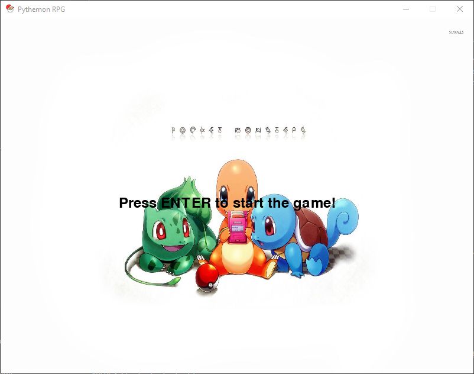
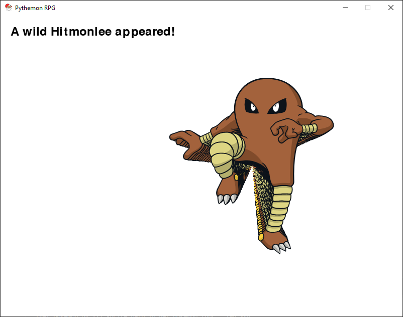
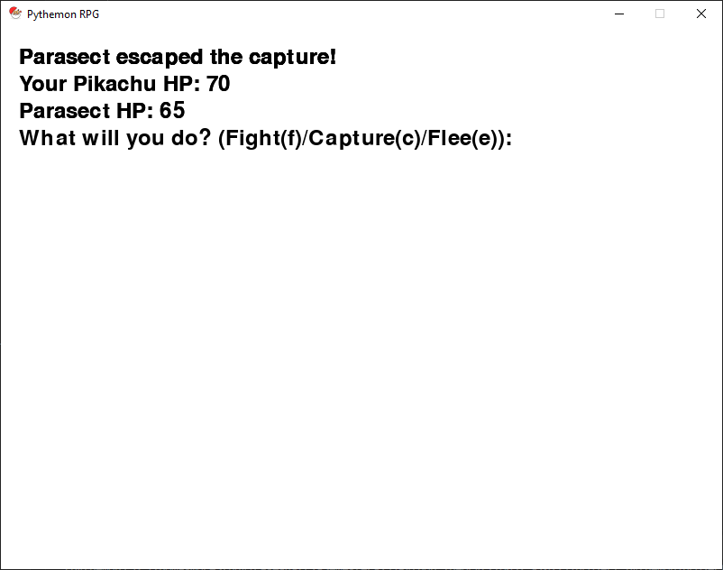
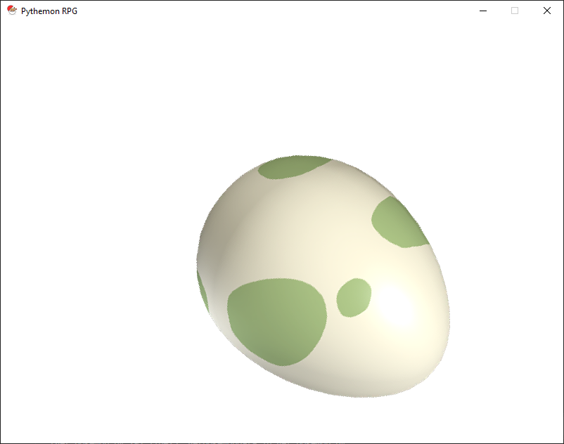

# Project Pythemon

Project Pythemon is a Pokémon-inspired game developed in Python using Pygame.

## Overview

Pythemon is a Pokémon battle simulation game built using Python and Pygame. The game allows players to capture, train, and battle Pokémon in a simulated environment. The project leverages various libraries and APIs to provide a rich gaming experience.

## Features

- Catch and train Pokémon
- Battle against wild Pokémon's

## Gameplay Screenshots

### Main Menu



### Wild Pokémon Scene





### Battle Screen




### Capture Screen



## Project Structure

```

**pycache**/
asset/

database.py

game_logic_last.py

get_pokemon.py

load_color.py

main_last.py

pygame_graphics.py

README.md

requirements.txt

sprites-master/
.gitignore

bower.json

    LICENCE.txt

package.json

README.md

    scripts/


forms.json

    	renameSmogon.sh
    sprites/
    	pokemon/
    		other/
    			dream-world/

```

## Installation

To install the required dependencies:

1. **Clone the repository:**

   ```sh
   git clone https://github.com/yourusername/pythemon.git
   cd pythemon
   ```

2. **Create and activate a virtual environment (optional but recommended):**

   - On Windows:
     ```sh
     python -m venv venv
     .\venv\Scripts\activate
     ```
   - On macOS and Linux:
     ```sh
     python3 -m venv venv
     source venv/bin/activate
     ```

3. **Install dependencies:**

   ```sh
   pip install -r requirements.txt
   ```

4. **Set up the database:**
   ```sh
   python database.py
   ```

## Usage

1. **Run the game:**

   ```sh
   python main_last.py
   ```

2. **Controls:**
   - Press [`ENTER`](<command:_github.copilot.openSymbolFromReferences?%5B%22%22%2C%5B%7B%22uri%22%3A%7B%22scheme%22%3A%22file%22%2C%22authority%22%3A%22%22%2C%22path%22%3A%22%2Fd%3A%2FThomasMoreStudy%2FFase-4-(F2-Semester-1)%2FPython_Theory(YT6037%20-2022)%2Fproject_pythemon%2FprojectPythemon%2Fmain_last.py%22%2C%22query%22%3A%22%22%2C%22fragment%22%3A%22%22%7D%2C%22pos%22%3A%7B%22line%22%3A77%2C%22character%22%3A28%7D%7D%5D%2C%22ae20bb05-4e14-4dc6-9e69-66e8ac057654%22%5D> "Go to definition") to start the game.
   - Press [`ESC`](<command:_github.copilot.openSymbolFromReferences?%5B%22%22%2C%5B%7B%22uri%22%3A%7B%22scheme%22%3A%22file%22%2C%22authority%22%3A%22%22%2C%22path%22%3A%22%2Fd%3A%2FThomasMoreStudy%2FFase-4-(F2-Semester-1)%2FPython_Theory(YT6037%20-2022)%2Fproject_pythemon%2FprojectPythemon%2Fmain_last.py%22%2C%22query%22%3A%22%22%2C%22fragment%22%3A%22%22%7D%2C%22pos%22%3A%7B%22line%22%3A87%2C%22character%22%3A42%7D%7D%5D%2C%22ae20bb05-4e14-4dc6-9e69-66e8ac057654%22%5D> "Go to definition") to quit the game.

## Code Overview

### database.py/Python_Theory(YT6037 -2022)/project_pythemon/projectPythemon/database.py)

Handles the creation and management of the SQLite database for storing player Pokémon data.

```py
import sqlite3

conn = sqlite3.connect("player_pokemon.db")
cursor = conn.cursor()

# Create a table to store player Pokémon
cursor.execute('''
    CREATE TABLE IF NOT EXISTS player_pokemon (
        id INTEGER PRIMARY KEY,
        name TEXT,
        level INTEGER,
        hp INTEGER,
        attack INTEGER,
        defense INTEGER,
        sprite_path TEXT
    )
''')

conn.commit()
```

### game_logic_last.py/Python_Theory(YT6037 -2022)/project_pythemon/projectPythemon/game_logic_last.py)

Defines the core game logic, including the [`Pokemon`](<command:_github.copilot.openSymbolFromReferences?%5B%22%22%2C%5B%7B%22uri%22%3A%7B%22scheme%22%3A%22file%22%2C%22authority%22%3A%22%22%2C%22path%22%3A%22%2Fd%3A%2FThomasMoreStudy%2FFase-4-(F2-Semester-1)%2FPython_Theory(YT6037%20-2022)%2Fproject_pythemon%2FprojectPythemon%2Fgame_logic_last.py%22%2C%22query%22%3A%22%22%2C%22fragment%22%3A%22%22%7D%2C%22pos%22%3A%7B%22line%22%3A37%2C%22character%22%3A30%7D%7D%2C%7B%22uri%22%3A%7B%22scheme%22%3A%22file%22%2C%22authority%22%3A%22%22%2C%22path%22%3A%22%2Fd%3A%2FThomasMoreStudy%2FFase-4-(F2-Semester-1)%2FPython_Theory(YT6037%20-2022)%2Fproject_pythemon%2FprojectPythemon%2Fgame_logic_last.py%22%2C%22query%22%3A%22%22%2C%22fragment%22%3A%22%22%7D%2C%22pos%22%3A%7B%22line%22%3A133%2C%22character%22%3A6%7D%7D%2C%7B%22uri%22%3A%7B%22scheme%22%3A%22file%22%2C%22authority%22%3A%22%22%2C%22path%22%3A%22%2Fd%3A%2FThomasMoreStudy%2FFase-4-(F2-Semester-1)%2FPython_Theory(YT6037%20-2022)%2Fproject_pythemon%2FprojectPythemon%2Fsprites-master%2FREADME.md%22%2C%22query%22%3A%22%22%2C%22fragment%22%3A%22%22%7D%2C%22pos%22%3A%7B%22line%22%3A267%2C%22character%22%3A143%7D%7D%5D%2C%22ae20bb05-4e14-4dc6-9e69-66e8ac057654%22%5D> "Go to definition") and `GameState` classes.

## Sprites

The sprites-master/Python_Theory(YT6037 -2022)/project_pythemon/projectPythemon/sprites-master) directory contains various Pokémon sprites used in the game. These sprites are organized by generation and type.

## Contributing

1. Fork the repository.
2. Create a new branch (`git checkout -b feature-branch`).
3. Make your changes.
4. Commit your changes ([`git commit -am 'Add new feature'`](<command:_github.copilot.openSymbolFromReferences?%5B%22%22%2C%5B%7B%22uri%22%3A%7B%22scheme%22%3A%22file%22%2C%22authority%22%3A%22%22%2C%22path%22%3A%22%2Fd%3A%2FThomasMoreStudy%2FFase-4-(F2-Semester-1)%2FPython_Theory(YT6037%20-2022)%2Fproject_pythemon%2FprojectPythemon%2Fdatabase.py%22%2C%22query%22%3A%22%22%2C%22fragment%22%3A%22%22%7D%2C%22pos%22%3A%7B%22line%22%3A18%2C%22character%22%3A5%7D%7D%5D%2C%22ae20bb05-4e14-4dc6-9e69-66e8ac057654%22%5D> "Go to definition")).
5. Push to the branch (`git push origin feature-branch`).
6. Create a new Pull Request.

## License

This project is licensed under the MIT License. See the LICENSE file for details.

## Acknowledgements

- [PokeAPI](https://pokeapi.co/) for providing the Pokémon data.
- [Smogon community](https://www.smogon.com/) for the custom sprites.
- [Pygame](https://www.pygame.org/) for the game development library.

## Contact

For any questions or suggestions, please open an issue or contact the project maintainers.

---

Enjoy playing Pythemon!

```

```
